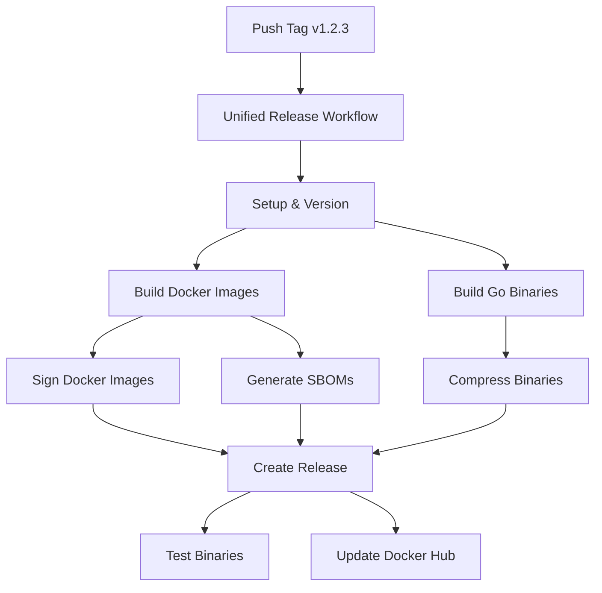

# Release Process

## Overview

The GeoIP Updater uses a **unified release workflow** that builds both Docker images and Go binaries from a single version tag. This ensures consistency across all release artifacts.

## Workflow Files

### 1. `.github/workflows/release.yml` (Production Releases)
- **Trigger**: Version tags (`v*`)
- **Purpose**: Build and release production versions
- **Artifacts**: 
  - 8 Docker images (multi-platform: linux/amd64, linux/arm64)
  - 9 Go binaries (Linux, macOS, Windows, FreeBSD)
  - SBOMs for all Docker images
  - Checksums for all binaries

### 2. `.github/workflows/docker-build.yml` (CI/CD)
- **Trigger**: Main branch pushes, PRs, weekly schedule
- **Purpose**: Development builds and CI/CD
- **Artifacts**: Docker images with tags like `latest`, `pr-123`, `weekly`

## Creating a Release

### Method 1: Automatic Release (Recommended)

1. **Create and push a version tag:**
   ```bash
   git tag v1.2.3
   git push origin v1.2.3
   ```

2. **Workflow automatically:**
   - Builds all Docker images for multiple platforms
   - Signs Docker images with Cosign
   - Generates SBOMs for security compliance
   - Builds Go binaries for all platforms
   - Creates GitHub release with all artifacts
   - Updates Docker Hub descriptions

### Method 2: Manual Release (GitHub UI)

1. **Create release via GitHub UI:**
   - Go to Releases → Draft a new release
   - Create tag: `v1.2.3`
   - Add your release notes
   - Publish release

2. **Workflow automatically:**
   - Detects existing release
   - Preserves your manual release notes
   - Adds all build artifacts to your release
   - Does NOT overwrite your content

### Method 3: Manual Workflow Dispatch

1. **Trigger via GitHub Actions:**
   - Go to Actions → Unified Release
   - Click "Run workflow"
   - Enter version (e.g., `v1.2.3`)
   - Run workflow

## Release Artifacts

### Docker Images

All images are pushed with consistent version tags:
- `ytzcom/geoip-scripts:v1.2.3`
- `ytzcom/geoip-updater:v1.2.3`
- `ytzcom/geoip-updater-cron:v1.2.3`
- `ytzcom/geoip-updater-k8s:v1.2.3`
- `ytzcom/geoip-updater-go:v1.2.3`
- `ytzcom/geoip-api:v1.2.3`
- `ytzcom/geoip-api-nginx:v1.2.3`
- `ytzcom/geoip-api-dev:v1.2.3`

### Go Binaries

Platform-specific binaries with three formats each:
- Uncompressed (direct executable)
- Gzip compressed (`.gz`)
- Tar archive (`.tar.gz`)

**Platforms:**
- Linux: amd64, arm64, arm-v7
- macOS: amd64 (Intel), arm64 (Apple Silicon)
- Windows: amd64, arm64
- FreeBSD: amd64

### Security & Verification

- **Docker Images**: Signed with Cosign (keyless signing via GitHub OIDC)
- **SBOMs**: Software Bill of Materials for all Docker images
- **Checksums**: SHA256 and MD5 for all binaries

## Workflow Architecture



## Development Workflow

For development and testing, use the CI/CD workflow:

```bash
# Push to main branch → builds with 'latest' tag
git push origin main

# Create PR → builds with 'pr-123' tag
git push origin feature-branch

# Weekly scheduled builds → 'weekly' tag (security updates)
```

## Version Numbering

Follow semantic versioning:
- **Major**: Breaking changes (v2.0.0)
- **Minor**: New features (v1.3.0)
- **Patch**: Bug fixes (v1.2.4)

Always prefix versions with `v` (e.g., `v1.2.3`, not `1.2.3`)

## Troubleshooting

### Release Already Exists
The workflow intelligently handles existing releases:
- Preserves manual release notes
- Appends automated content
- Adds all artifacts without overwriting

### Missing Artifacts
If artifacts are missing:
1. Check workflow run logs
2. Verify all jobs completed successfully
3. Re-run failed jobs if needed

### Docker Hub Rate Limits
The workflow includes retry logic for Docker operations.

## Best Practices

1. **Test Before Release**: Ensure all tests pass on main branch
2. **Update CHANGELOG**: Document changes before tagging
3. **Use Semantic Versioning**: Be consistent with version numbers
4. **Verify Artifacts**: Check release page after workflow completes
5. **Monitor Docker Hub**: Ensure images are properly pushed

## Security Considerations

- All release builds run on GitHub-hosted runners
- Docker images are signed with keyless signatures
- SBOMs provide supply chain transparency
- Vulnerability scanning with Trivy
- Checksums for binary verification

## Support

For issues with the release process:
1. Check [GitHub Actions logs](../../actions)
2. Review this documentation
3. Open an issue if problems persist